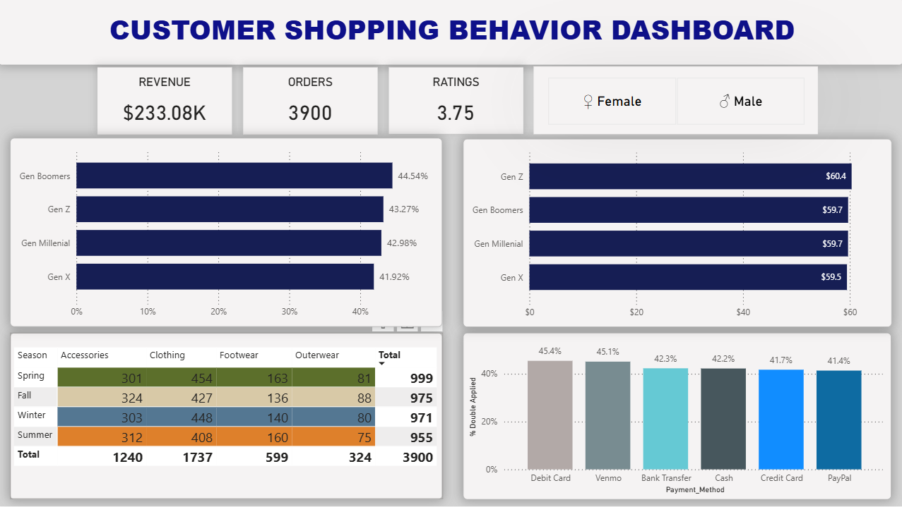

# 📊 Customer-Shopping-Behavior-Analysis-SQL-Pbi


*(Note: Please ensure the image path matches your folder structure)*

## 📌 Project Overview
This project focuses on **End-to-End Data Analysis**, starting from raw data processing using **SQL** to interactive visualization using **Power BI**. The main goal is to transform raw customer data into meaningful insights through logic-based segmentation and data cleaning.

## 🛠️ Tools & Technologies
- **SQL (Structured Query Language):** Used for Data Cleaning, Standardization, and Business Logic implementation.
- **Power BI:** Used for creating the interactive dashboard and reporting.
- **GitHub:** Version control and documentation.

## ⚙️ Data Transformation & Logic (SQL)
Before visualizing the data, I performed several data transformation steps to ensure data quality:
1.  **Standardized Columns:** Renamed and reformatted columns for consistency.
2.  **Handled NULL Values:** Implemented logic to manage missing data points.
3.  **Customer Segmentation:** Created a custom logic to categorize users into generations (Gen Z, Millennials, etc.).

### 🔍 Key SQL Logic Snippet
Here is the `CASE WHEN` statement used to segment the customers based on their generations:

```sql
alter table shopping_behavior
add Generations varchar(20);

update shopping_behavior
set Generations = case
  WHEN Age BETWEEN 61 AND 79 THEN 'Gen Boomers'
  WHEN Age BETWEEN 45 AND 60 THEN 'Gen X'
  WHEN Age BETWEEN 29 AND 44 THEN 'Gen Millenial'
  WHEN Age BETWEEN 13 AND 28 THEN 'Gen Z'
  WHEN Age BETWEEN 0 AND 12 THEN 'Gen Alpha'
  else 'Others'
end;
```

🚨 Critical Insight: Operational Anomaly Detected
During the exploratory data analysis (EDA), I uncovered a significant discrepancy in discount usage behavior that points to a potential System Bug.

The Anomaly: Zero "Stacked Discount" for Females
While analyzing the effectiveness of promotions, I found that 0% of Female customers were able to apply both a Discount and a Promo Code simultaneously. In contrast, 63.24% of Male customers successfully used both.


🔎 SQL Investigation Code
The following query was used to isolate and validate this anomaly:
```sql
SELECT 
    Gender,
    SUM(CASE WHEN Discount_Applied = 'Yes' AND Promo_Code_Used = 'Yes' THEN 1 ELSE 0 END) AS DoubleApplied,
    COUNT(*) AS Jumlah,
    CAST(SUM(CASE WHEN Discount_Applied = 'Yes' AND Promo_Code_Used = 'Yes' THEN 1 ELSE 0 END) * 100.0 / COUNT(*) AS DECIMAL(5,2)) AS Persentase
FROM shopping_behavior
GROUP BY Gender
ORDER BY Persentase desc;
```
Recommendation: This extreme variance suggests a technical validation error in the checkout system for Female accounts. Immediate technical review is recommended to prevent revenue loss or customer dissatisfaction.

📈 Dashboard Highlights
The interactive Power BI dashboard visualizes the full scope of the analysis, featuring:
- Anomaly Alert Visualization: A clear chart highlighting the discrepancy in promo usage between genders.
- Demographic Analysis: Spending habits breakdown by Generation (Gen Z vs. Millennial).
- Sales Performance: Overview of top-performing categories and regional trends.

🚀 How to Use This Project
1. Clone the Repository:
Bash
git clone [[https://github.com/your-username/your-repo-name.git](https://github.com/mrinaldy22/Customer-Shopping-Behavior-Analysis-SQL-Pbi.git)]
2. Explore SQL Scripts: Check the SQL_Scripts/ folder to see the full data cleaning and transformation queries.
3. View Dashboard: Open the .pbix file in the PowerBI/ folder (requires Power BI Desktop).

Author: Muhammad Rinaldy Rustam

Data Analyst Enthusiast | Information Systems Graduate


